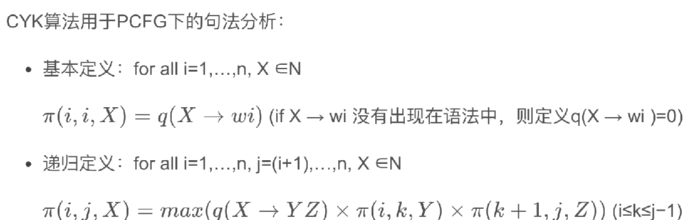
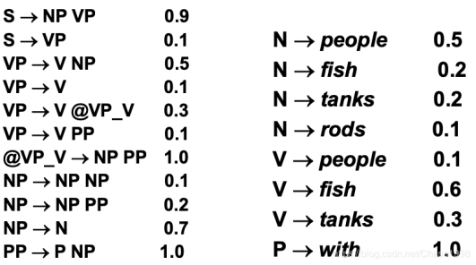
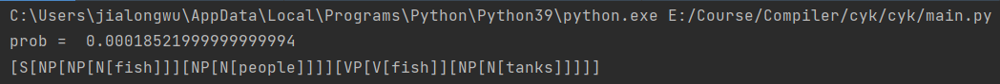
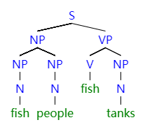

| 院系   | 年级专业           | 姓名   | 学号       | 实验时间   |
| ------ | ------------------ | ------ | ---------- | ---------- |
| 计科院 | 19计算机科学与技术 | 吴家隆 | 1915404063 | 2021.10.25 |

------

编程语言：**python3.9**

# 实验内容

## 概率上下文无关文法

PCFG在GFG的基础上引入了P，加上了每个规则的概率。

PCFG中定义一棵句法树的概率为所有用到的规则概率的乘积，一般来说，概率值大的更可能是正确的句法树。 

## CYK算法

CYK算法是一个基于“动态规划”算法设计思想，用于测试串w对于一个上下文无关文法L的成员性的一个算法。CYK算法可以在O(n^5^)的时间内得出结果。CYK算法是由三个独立发现同样思想本质的人（J. Cocke、 D. Younger和T. Kasami）来命名的。



------



基于上述文法和CYK算法，编程求句子**fish people fish tanks**的**最优分析树**。

# 实验步骤

## 数据预处理

首先规范要处理的文法格式，句法产生式每个终结符或者非终结符用空格隔开，在产生式后面加入**prob:** 表示发生的概率

```txt
S -> NP VP prob:0.9
S -> VP prob:0.1
VP -> V NP prob:0.5
VP -> V prob:0.1
VP -> V @VP_V prob:0.3
VP -> V PP prob:0.1
@VP_V -> NP PP prob:1.0
NP -> NP NP prob:0.1
NP -> NP PP prob:0.2
NP -> N prob:0.7
PP -> P NP prob:1.0
N -> people prob:0.5
N -> fish prob:0.2
N -> tanks prob:0.2
N -> rods prob:0.1
V -> people prob:0.1
V -> fish prob:0.6
V -> tanks prob:0.3
P -> with prob:1.0
```

在实验中规定以下变量来存储产生式

```python
non_terminal = set()
start_symbol = 'S'
terminal = set()
rules_prob = {}
```

| non_terminal | start_symbol | terminal | rules_prob                   |
| ------------ | ------------ | -------- | ---------------------------- |
| 非终结符     | 初始非终结符 | 终结符   | 产生语法规则集合（包含概率） |

使用了read_data(filename)函数对data.txt进行读取，并给上述变量完成数据初始化

```python
def read_data(filename):
    with open(filename, "r", encoding="utf-8") as x:
        data = x.readlines()
        for i in data:
            productions, prob = i.split("prob:")
            prob = float(prob)
            start, generations = productions.split("->")
            start = start.strip()
            generation = generations.split()
            if start not in non_terminal:
                non_terminal.add(start)
            if len(generation) == 1 and generation[0].islower():
                terminal.add(generation[0])
            if start not in rules_prob:
                new_adic = {}
                if len(generation) > 1:
                    new_adic[tuple(generation)] = prob
                    rules_prob[start] = new_adic
                if len(generation) == 1:
                    new_adic[generation[0]] = prob
                    rules_prob[start] = new_adic
            else:
                if len(generation) > 1:
                    rules_prob[start][tuple(generation)] = prob
                if len(generation) == 1:
                    rules_prob[start][generation[0]] = prob
```

## CYK算法

### 概述

给定一个句子s 和一个上下文无关文法PCFG，G=(T, N, S, R, P),定义一个跨越单词 i到j的概率最大的语法成分π: π(i,j,X)(i,j∈1…n ,X∈N)，目标是找到一个属于π[1,n,S]的所有树中概率最大的那棵。

1. T代表终端符集合
2. N代表非终端符集合
3. S代表初始非端结符
4. R代表产生语法规则集
5. P 代表每条产生规则的统计概率

伪代码:

```c++
function CKY(words, grammar):
    score = new double[(words)+1][(words)+1][(nonterms)]
    back = new Pair[(words)+1][(words)+1][(nonterms)]
    for i=0; i<(words); i++
        for A in nonterms
            if A -> words[i] in grammar
                score[i][i+1][A] = P(A -> words[i])
        boolean added = true
        while added
            added = false
            for A, B in nonterms
                if score[i][i+1][B] > 0 && A->B in grammar
                    prob = P(A->B)*score[i][i+1][B]
                    if prob > score[i][i+1][A]
                        score[i][i+1][A] = prob
                        back[i][i+1][A] = B
            added = true
    for span = 2 to words
        for begin = 0 to words - span
            end = begin + span
            for split = begin+1 to end-1
                for A,B,C in nonterms
                    prob=score[begin][split][B]*score[split][end][C]*P(A->BC)
                        if prob > score[begin][end][A]
                            score[begin]end][A] = prob
                            back[begin][end][A] = new Triple(split,B,C)
                boolean added = true
                while added
                    added = false
                    for A, B in nonterms
                        prob = P(A->B)*score[begin][end][B];
                            if prob > score[begin][end][A]
                                score[begin][end][A] = prob
                                back[begin][end][A] = B
                    added = true
    //返回最佳路径树
    return buildTree(score, back)
```

 score存放最大概率，back存放分裂点信息以便回溯，在接下来的具体算法实现，将用特别的数据结构实现数据信息的存储。

| score\[0][0] | score\[0][1]     | **score\[0][2]** | score\[0][3]     |
| ------------ | ---------------- | ---------------- | ---------------- |
|              | **score\[1][1]** | **score\[1][2]** | **score\[1][3]** |
|              |                  | **score\[2][2]** | **score\[2][3]** |
|              |                  |                  | **score\[3][3]** |

用矩阵的方式存储信息，以每个单词作为对角线上的元素，也就是树结构的叶结点。运用动态规划的思想进行填表，直到右上角计算出来，整棵树的结点信息就全部计算处理。

### 构建

在本实验中，构建了my_CYK(object)类来执行cyk算法，在\__init__中初始化了非终结符，终结符，初始非终结符，产生语法规则集合

```python
class my_CYK(object):
    def __init__(self, non_ternimal, terminal, rules_prob, start_prob):
        self.non_terminal = non_ternimal
        self.terminal = terminal
        self.rules_prob = rules_prob
        self.start_symbol = start_prob
```

parse_sentence（self,sentence）函数对输入的sentence进行分析，将字典和列表两种数据结构结合，实现概率的存储和路径信息的保存。

```python
word_list = sentence.split()
best_path = [[{} for _ in range(len(word_list))] for _ in range(len(word_list))]
for i in range(len(word_list)):
    for j in range(len(word_list)):
        for x in self.non_terminal:
            best_path[i][j][x] = {'prob': 0.0, 'path': {'split': None, 'rule': None}}
```

### 叶节点

本次实验的文法规则满足右部或者是两个非终端符或者是一个终端符的条件，所以是**CNF（乔姆斯基范式）**。

- 遍历非终端符，找到并计算此条非终端-终端语法的概率
- 生成新的语法需要加入

```python
for i in range(len(word_list)):
    for x in self.non_terminal:
        if word_list[i] in self.rules_prob[x].keys():
            best_path[i][i][x]['prob'] = self.rules_prob[x][word_list[i]] 
            best_path[i][i][x]['path'] = {'split': None, 'rule': word_list[i]} 
            for y in self.non_terminal:
                if x in self.rules_prob[y].keys():
                    best_path[i][i][y]['prob'] = self.rules_prob[x][word_list[i]] * self.rules_prob[y][x]
                    best_path[i][i][y]['path'] = {'split': i, 'rule': x}
```

### 非叶节点

```python
for l in range(1, len(word_list)):
    for i in range(len(word_list) - l):
        j = i + l
        for x in self.non_terminal:
            tmp_best_x = {'prob': 0, 'path': None}

            for key, value in self.rules_prob[x].items():
                if key[0] not in self.non_terminal:
                    break     
                for s in range(i, j): 
                    if len(key) == 2:
                        tmp_prob = value * best_path[i][s][key[0]]['prob'] * best_path[s + 1][j][key[1]]['prob']
                    else:
                        tmp_prob = value * best_path[i][s][key[0]]['prob'] * 0
                    if tmp_prob > tmp_best_x['prob']:
                        tmp_best_x['prob'] = tmp_prob
                        tmp_best_x['path'] = {'split': s, 'rule': key} 
            best_path[i][j][x] = tmp_best_x 
```

 扩展的CYK算法需要处理一元语法规则，判断key的len值可以避免一元规则计算时候的数组越界。

 此步骤结束之后得到上三角每个结点的最大概率语法规则和分裂点路径，用于接下来路径回溯得到语法树。

### 构建语法树

构建经典的节点类

```python
class Node:
    def __init__(self, val=None):
        self.val = val
        self.l_child = []

    def add_child(self, node):
        self.l_child.append(node)
```

代码中使用到构建语法树的部分

```python
treenode = Node("")
back(best_path, 0, 3, 'S',treenode)
```

回溯算法

```python
def back(best_path, left, right, root, freenode,ind=0):
    node = best_path[left][right][root]
    if node['path']['split'] is not None:
        childnode = Node(root)
        freenode.add_child(childnode)
        if len(node['path']['rule']) == 2:
            back(best_path, left, node['path']['split'], node['path']['rule'][0], childnode,ind + 1)
            back(best_path, node['path']['split'] + 1, right, node['path']['rule'][1], childnode,ind+1)
        else:
            back(best_path, left, node['path']['split'], node['path']['rule'][0], childnode,ind + 1)
    else:
        childnode = Node(root)
        freenode.add_child(childnode)
        leafnode = Node(node['path']['rule'])
        childnode.add_child(leafnode)
```

### 结果打印

将构建的语法树打印成字符串形式，使用中括号嵌套的形式

```python
print("prob = ", best_path[0][len(word_list) - 1][self.start_symbol]['prob'])
global res
res = ''
def put2str(node):
    global res
    if node:
        res += node.val
    if node.l_child:
        for i in node.l_child:
            res += "["
            put2str(i)
            res += "]"
put2str(treenode)
print(res)
```

# 实验结果

score部分

| fish                                                         | people                                                       | fish                                                         | tanks                                                        |
| ------------------------------------------------------------ | ------------------------------------------------------------ | ------------------------------------------------------------ | ------------------------------------------------------------ |
| **N -> fish** 0.2<br />**V -> fish** 0.6<br />**NP -> N** 0.14<br />**VP -> V** 0.06<br />**S -> VP** 0.006 | **NP ->NP NP** 0.0049<br />**VP -> V NP** 0.105<br />**S -> VP** 0.0105 | **NP ->NP NP** 6.86e-5<br />**VP -> V NP** 0.00147<br />**S -> NP VP** 8.82e-4 | **NP -> NP NP** 9.604e-7<br />**VP -> V NP** 2.058e-5<br />**S -> NP VP** 1.8522e-4 |
|                                                              | **N -> people** 0.5<br />**V -> people** 0.1<br />**NP ->N** 0.35<br />**VP -> V** 0.01<br />**S -> VP** 0.001 | **NP -> NP NP** 0.0049<br />**VP -> V NP** 0.007<br />**S -> NP VP** 0.0189 | **NP -> NP NP** 6.86e-5<br />**VP -> V NP** 9.8e-5<br />**S -> NP VP** 0.01323 |
|                                                              |                                                              | **N -> fish** 0.2<br />**V -> fish** 0.6<br />**NP -> N** 0.14<br />**VP -> V** 0.06<br />**S -> VP** 0.006 | **NP ->NP NP** 0.00196<br />**VP -> V NP** 0.042<br />**S -> VP** 0.0042 |
|                                                              |                                                              |                                                              | **N -> tanks** 0.2<br />**V -> tanks** 0.3<br />**NP -> N** 0.14<br />**VP -> V** 0.03<br />**S ->VP** 0.003 |

程序运行结果如图



最优分析树字符串形式
$$
[S[NP[NP[N[fish]]][NP[N[people]]]][VP[V[fish]][NP[N[tanks]]]]]
$$
生成的树状图



结果正确
