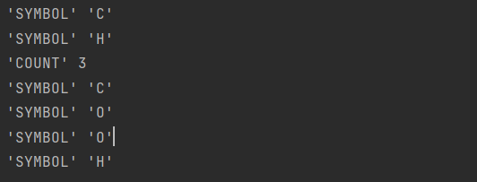
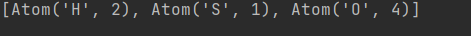
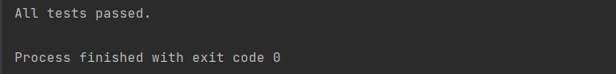

| 院系   | 年级专业           | 姓名   | 学号       | 实验时间   |
| ------ | ------------------ | ------ | ---------- | ---------- |
| 计科院 | 19计算机科学与技术 | 吴家隆 | 1915404063 | 2021.10.25 |

------

编程语言：**python3.9**

# 实验内容

- 阅读PLY使用手册

  [PLY (Python Lex-Yacc) — ply 4.0 documentation](https://ply.readthedocs.io/en/latest/ply.html)

  [Python Lex Yacc中文手册](https://github.com/PChou/python-lex-yacc)

  PLY包含两个独立的模块：lex.py和yacc.py，都定义在ply包下。lex.py模块用来将输入字符通过一系列的正则表达式分解成标记序列，yacc.py通过一些上下文无关的文法来识别编程语言语法。yacc.py使用LR解析法，并使用LALR(1)算法（默认）或者SLR算法生成分析表。

  **lex.py是用来将输入字符串标记化**

  **yacc.py用来对语言进行语法分析。**

- 熟悉yacc_example中分析四则运算的程序

  标记列表

  ```python
  tokens = (
     'NUMBER',
     'PLUS',
     'MINUS',
     'TIMES',
     'DIVIDE',
     'LPAREN',
     'RPAREN',
  )
  ```

  标记的规则的形式有两种

  ```python
  t_PLUS = r'\+'
  ```

  ```python
  def t_NUMBER(t):
      r'\d+'
      t.value = int(t.value)
      return t
  ```

  在yacc中每个语法规则被定义成一个Python的方法，方法的文档字符串描述了相应的上下文无关文法，方法的语句实现了对应规则的语义行为。每个方法接受一个单独的`p`参数，`p`是一个包含有当前匹配语法的符号的序列，`p[i]`与语法符号的对应关系如下：

  ```python
  def p_expression_plus(p):
      'expression : expression PLUS term'
      #   ^            ^        ^    ^
      #  p[0]         p[1]     p[2] p[3]
      p[0] = p[1] + p[3]
  ```

- **编写程序，计算化学分子式中元素的数目，并完成以下测试：**

$$
atom\_count(He) == 1 \\

atom\_count(H2) == 2 \\

atom\_count(H2SO4) == 7 \\

atom\_count(CH3COOH) == 8 \\

atom\_count(NaCl) == 2 \\

atom\_count(C60H60) == 120
$$

# 实验步骤

## 使用lex进行序列标记

ply使用"t_"开头的变量来表示规则。如果变量是一个字符串，那么它被解释为一个正则表达式，匹配值是标记的值。 如果变量是函数，则其文档字符串包含模式，并使用匹配的标记调用该函数。该函数可以自由地修改序列或返回一个新的序列来代替它的位置。 如果没有返回任何内容，则忽略匹配。 通常该函数只更改“value”属性，它最初是匹配的文本。 在下面的 t_COUNT 将值转换为 int。

```python
import ply.lex as lex

tokens = (
    "SYMBOL",
    "COUNT"
)

t_SYMBOL = (
    r"C[laroudsemf]?|Os?|N[eaibdpos]?|S[icernbmg]?|P[drmtboau]?|"
    r"H[eofgas]?|A[lrsgutcm]|B[eraik]?|Dy|E[urs]|F[erm]?|G[aed]|"
    r"I[nr]?|Kr?|L[iaur]|M[gnodt]|R[buhenaf]|T[icebmalh]|"
    r"U|V|W|Xe|Yb?|Z[nr]")

def t_COUNT(t):
    r"\d+"
    t.value = int(t.value)
    return t

def t_error(t):
    raise TypeError("Unknown text '%s'" % (t.value,))
```

对**CH3COOH**进行测试

```python
lex.lex()

lex.input("CH3COOH")
for tok in iter(lex.token, None):
    print(repr(tok.type), repr(tok.value))
```

结果如下



## 使用yacc进行语法分析

PLY 的解析器适用于lex解析出的序列标记。 它使用 BNF 语法来描述这些标记是如何组装的。 解析器可以处理一些歧义。 在我们的化学分子式解析中，语法在阅读化学符号之后是不明确的。

解析算法的名称有 LALR(1)、SLR、LL 和 LR。

化学解析式有以下4种语法
$$
species\_list :  species\_list species \\

species\_list :  species \\

species : SYMBOL \\

species : SYMBOL\  COUNT
$$

```python
class Atom(object):
    def __init__(self, symbol, count):
        self.symbol = symbol
        self.count = count
    def __repr__(self):
        return "Atom(%r, %r)" % (self.symbol, self.count)


# When parsing starts, try to make a "chemical_equation" because it's
# the name on left-hand side of the first p_* function definition.
def p_species_list(p):
    "chemical_equation :  chemical_equation species"
    p[0] = p[1] + [p[2]]

def p_species(p):
    "chemical_equation : species"
    p[0] = [p[1]]

def p_single_species(p):
    """
    species : SYMBOL
    species : SYMBOL COUNT
    """
    if len(p) == 2:
        p[0] = Atom(p[1], 1)
    elif len(p) == 3:
        p[0] = Atom(p[1], p[2])
        
def p_error(p):
    print("Syntax error at '%s'" % p.value)
```

对**H2SO4**进行测试

```python
yacc.yacc()

print(yacc.parse("H2SO4"))
```

结果如下



定义原子计数函数

```python
def atom_count(s):
    count = 0
    for atom in yacc.parse(s):
        count += atom.count
    return count
```

# 实验结果

## 测试函数

为实验要求的几个化学分子式元素的数目进行测试

```python
def test():
    assert atom_count("He") == 1
    assert atom_count("H2") == 2
    assert atom_count("H2SO4") == 7
    assert atom_count("CH3COOH") == 8
    assert atom_count("NaCl") == 2
    assert atom_count("C60H60") == 120
```

```python
if __name__ == "__main__":
    test()
    print("All tests passed.")
```

## 结果

结果如下



## 其他

自动生成的语法分析表

```python
# parsetab.py
# This file is automatically generated. Do not edit.
# pylint: disable=W,C,R
_tabversion = '3.10'

_lr_method = 'LALR'

_lr_signature = 'COUNT SYMBOL\n    chemical_equation :\n    chemical_equation : species_list\n    species_list :  species_list speciesspecies_list : species\n    species : SYMBOL\n    species : SYMBOL COUNT\n    '
    
_lr_action_items = {'$end':([0,1,2,3,4,5,6,],[-1,0,-2,-4,-5,-3,-6,]),'SYMBOL':([0,2,3,4,5,6,],[4,4,-4,-5,-3,-6,]),'COUNT':([4,],[6,]),}

_lr_action = {}
for _k, _v in _lr_action_items.items():
   for _x,_y in zip(_v[0],_v[1]):
      if not _x in _lr_action:  _lr_action[_x] = {}
      _lr_action[_x][_k] = _y
del _lr_action_items

_lr_goto_items = {'chemical_equation':([0,],[1,]),'species_list':([0,],[2,]),'species':([0,2,],[3,5,]),}

_lr_goto = {}
for _k, _v in _lr_goto_items.items():
   for _x, _y in zip(_v[0], _v[1]):
       if not _x in _lr_goto: _lr_goto[_x] = {}
       _lr_goto[_x][_k] = _y
del _lr_goto_items
_lr_productions = [
  ("S' -> chemical_equation","S'",1,None,None,None),
  ('chemical_equation -> <empty>','chemical_equation',0,'p_chemical_equation','main.py',48),
  ('chemical_equation -> species_list','chemical_equation',1,'p_chemical_equation','main.py',49),
  ('species_list -> species_list species','species_list',2,'p_species_list','main.py',59),
  ('species_list -> species','species_list',1,'p_species','main.py',64),
  ('species -> SYMBOL','species',1,'p_single_species','main.py',70),
  ('species -> SYMBOL COUNT','species',2,'p_single_species','main.py',71),
]
```

yacc.py在生成分析表时会创建出一个调试文件

文件中出现的不同状态，代表了有效输入标记的所有可能的组合，这是依据文法规则得到的。当得到输入标记时，分析器将构造一个栈，并找到匹配的规则。每个状态跟踪了当前输入进行到语法规则中的哪个位置，在每个规则中，`’.’`表示当前分析到规则的哪个位置，而且，对于在当前状态下，输入的每个有效标记导致的动作也被罗列出来。

```out
Created by PLY version 3.11 (http://www.dabeaz.com/ply)

Grammar

Rule 0     S' -> chemical_equation
Rule 1     chemical_equation -> <empty>
Rule 2     chemical_equation -> species_list
Rule 3     species_list -> species_list species
Rule 4     species_list -> species
Rule 5     species -> SYMBOL
Rule 6     species -> SYMBOL COUNT

Terminals, with rules where they appear

COUNT                : 6
SYMBOL               : 5 6
error                : 

Nonterminals, with rules where they appear

chemical_equation    : 0
species              : 3 4
species_list         : 2 3

Parsing method: LALR

state 0

    (0) S' -> . chemical_equation
    (1) chemical_equation -> .
    (2) chemical_equation -> . species_list
    (3) species_list -> . species_list species
    (4) species_list -> . species
    (5) species -> . SYMBOL
    (6) species -> . SYMBOL COUNT

    $end            reduce using rule 1 (chemical_equation -> .)
    SYMBOL          shift and go to state 4

    chemical_equation              shift and go to state 1
    species_list                   shift and go to state 2
    species                        shift and go to state 3

state 1

    (0) S' -> chemical_equation .


state 2

    (2) chemical_equation -> species_list .
    (3) species_list -> species_list . species
    (5) species -> . SYMBOL
    (6) species -> . SYMBOL COUNT

    $end            reduce using rule 2 (chemical_equation -> species_list .)
    SYMBOL          shift and go to state 4

    species                        shift and go to state 5

state 3

    (4) species_list -> species .

    SYMBOL          reduce using rule 4 (species_list -> species .)
    $end            reduce using rule 4 (species_list -> species .)


state 4

    (5) species -> SYMBOL .
    (6) species -> SYMBOL . COUNT

    SYMBOL          reduce using rule 5 (species -> SYMBOL .)
    $end            reduce using rule 5 (species -> SYMBOL .)
    COUNT           shift and go to state 6


state 5

    (3) species_list -> species_list species .

    SYMBOL          reduce using rule 3 (species_list -> species_list species .)
    $end            reduce using rule 3 (species_list -> species_list species .)


state 6

    (6) species -> SYMBOL COUNT .

    SYMBOL          reduce using rule 6 (species -> SYMBOL COUNT .)
    $end            reduce using rule 6 (species -> SYMBOL COUNT .)
```

