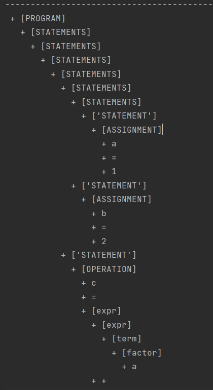

| 院系       | 年级专业 | 姓名   | 学号       | 实验日期  |
| ---------- | -------- | ------ | ---------- | --------- |
| 计算机学院 | 2019计科 | 吴家隆 | 1915404063 | 2021.11.8 |

*编程语言：**python3.9***

------

[TOC]

# 实验内容

- 利用PLY实现简单的Python程序的解析

  1.示例程序位于example/

  2.需要进行解析的文件为**example.py**

  要解析的内容为：

  ```python
  a=1
  b=2
  c=a+b
  d=c-1+a
  print(c)
  print(a,b,c)
  ```

  3.需要完成以下内容的解析

   *赋值语句*

   *完整的四则运算*

   *print语句*

  四则运算的无二义性下文法大致如下：
  $$
  expr -> expr + term | term\\
  
  term -> term * factor | factor\\ 
  
  factor -> id | (expr)
  $$
  （***\*不需要消除二义性\****）

  4.解析结果以语法树的形式呈现

- 编程实现语法制导翻译

  1.语法树上每个节点有一个属性value保存节点的值

  2.设置一个变量表保存每个变量的值

  3.基于深度优先遍历获取整个语法树的分析结果

# 实验步骤

## 使用lex进行序列标记

首先获取要解析的文本

```python
import ply.lex as lex
def clear_text(textlines):
    lines=[]
    for line in textlines:
        line=line.strip()
        if len(line)>0:
            lines.append(line)
    return ' '.join(lines)
```

在本次实验中要识别的tokens包括以下

```python
tokens = ('VARIABLE', 'NUMBER', 'PRINT')

literals = ['=', '+', '-', '*', '(', ')', '{', '}', '<', '>', ',']
```

ply使用"t_"开头的变量来表示规则。如果变量是一个字符串，那么它被解释为一个正则表达式，匹配值是标记的值。 如果变量是函数，则其文档字符串包含模式，并使用匹配的标记调用该函数。该函数可以自由地修改序列或返回一个新的序列来代替它的位置。 如果没有返回任何内容，则忽略匹配。 通常该函数只更改“value”属性，它最初是匹配的文本。

```python
def t_NUMBER(t):
    r'[0-9]+'
    return t
def t_PRINT(t):
    r'print'
    return t
def t_VARIABLE(t):
    r'[a-zA-Z]+'
    return t
t_ignore = " \t"
def t_error(t):
    print("Illegal character '%s'" % t.value[0])
    t.lexer.skip(1)
lex.lex()
```

对文本进行测试，输出每一个识别到的token

```python
text = clear_text(open('0.py', 'r').readlines())
lex.input(text)
for tok in iter(lex.token, None):
    print(repr(tok.type), repr(tok.value))
```

结果如下：


## 使用yacc进行语法分析

PLY 的解析器适用于lex解析出的序列标记。 它使用 BNF 语法来描述这些标记是如何组装的。 

对node进行定义

```python
class node:
    def __init__(self, data):
        self._data = data
        self._children = []
        self._value=None
    def getdata(self):
        return self._data
    def setvalue(self,value):
        self._value=value
    def getvalue(self):
        return self._value
    def getchild(self,i):
        return self._children[i]
    def getchildren(self):
        return self._children
    def add(self, node):
        self._children.append(node)
    def print_node(self, prefix):
        print ('  '*prefix,'+',self._data)
        for child in self._children:
            child.print_node(prefix+1)
def num_node(data):
    t=node(data)
    t.setvalue(float(data))
    return t
```

四则运算的无二义性下文法大致如下
$$
expr -> expr + term | term\\

term -> term * factor | factor\\ 

factor -> id | (expr)
$$
定义文法

```python
def simple_node(t, name):
    t[0] = node(name)
    for i in range(1, len(t)):
        t[0].add(node(t[i]))
    return t[0]
def p_program(t):
    '''program : statements'''
    if len(t) == 2:
        t[0] = node('[PROGRAM]')
        t[0].add(t[1])
def p_statements(t):
    '''statements : statements statement
                  | statement'''
    if len(t) == 3:
        t[0] = node('[STATEMENTS]')
        t[0].add(t[1])
        t[0].add(t[2])
    elif len(t) == 2:
        t[0] = node('[STATEMENTS]')
        t[0].add(t[1])
def p_statement(t):
    ''' statement : assignment
                  | operation
                  | print'''
    if len(t) == 2:
        t[0] = node(['STATEMENT'])
        t[0].add(t[1])
def p_assignment(t):
    '''assignment : VARIABLE '=' NUMBER'''
    if len(t) == 4:
        t[0] = node('[ASSIGNMENT]')
        t[0].add(node(t[1]))
        t[0].add(node(t[2]))
        t[0].add(num_node(t[3]))
def p_operation(t):
    '''operation : VARIABLE '=' expr
    '''
    if len(t) == 4:
        t[0] = node('[OPERATION]')
        t[0].add(node(t[1]))
        t[0].add(node(t[2]))
        t[0].add(t[3])
def p_expr(t):
    '''expr : expr '+' term
            | expr '-' term
            | term
    '''
    t[0] = node('[expr]')
    if(len(t) == 2):
        t[0].add(t[1])
    else:
        t[0].add(t[1])
        t[0].add(node(t[2]))
        t[0].add(t[3])

def p_term(t):
    '''term : term '*' factor
            | term '/' factor
            | factor
    '''
    t[0] = node('[term]')
    if(len(t) == 2):
        t[0].add(t[1])
    else:
        t[0].add(t[1])
        t[0].add(node(t[2]))
        t[0].add(t[3])

def p_factor(t):
    '''factor : VARIABLE
            | NUMBER
    '''
    t[0] = node('[factor]')
    # if(type(t[1]) == type(t[0])):
    #     print(type(t[1]))
    #     t[0].add(t[1])
    if(t[1].isdigit()):       #数字
        t[0].add(num_node(eval(t[1])))
    else:
        t[0].add(node(t[1]))

def p_print(t):
    '''print : PRINT '(' values ')'
    '''
    t[0] = node('[PRINT]')
    t[0].add(node(t[1]))
    t[0].add(node(t[2]))
    t[0].add(t[3])
    t[0].add(node(t[4]))

def p_values(t):
    '''values : VARIABLE
                | values ',' VARIABLE
    '''
    if(len(t) == 4):
        t[0] = node('[VARIABLES]')
        t[0].add(t[1])
        t[0].add(node(t[2]))
        t[0].add(node(t[3]))
    else:
        t[0] = node('[VARIABLE]')
        t[0].add(node(t[1]))
def p_error(t):
    print("Syntax error at '%s'" % t.value)
```

## 实行语法制导翻译

定义变量存储字典结构和更新函数

```python
v_table = {}  # variable table
def update_v_table(name, value):
    v_table[name] = value
```

翻译函数

```python
def trans(node):
    for c in node.getchildren():
        trans(c)
    # Translation
    # Assignment
    if (node.getdata() == '[ASSIGNMENT]'):
        ''' statement : VARIABLE '=' NUMBER'''
        value = node.getchild(2).getvalue()
        node.getchild(0).setvalue(value)
        # update v_table
        update_v_table(node.getchild(0).getdata(), value)
        #print(v_table)
    # Operation
    elif node.getdata() == '[OPERATION]':
        '''operation : VARIABLE '=' expr
        '''
        tmpname = node.getchild(0).getdata()      #变量名
        tmpvalue = calcExpr(node.getchild(2))
        node.getchild(0).setvalue(tmpvalue)
        update_v_table(tmpname, tmpvalue)
    # Print
    elif node.getdata() == '[PRINT]':
        '''print : PRINT '(' values ')'
        '''
        tmpLst = []
        for i in node.getchildren():
            showPrintData(i, tmpLst)
        tmpLst.reverse()
        for i in tmpLst: print(v_table[i], end="  ")
        print()
```

其他辅助函数

```python
def showPrintData(item, tmpLst) : #辅助函数: 递归输出树的所有节点
    if(item.getdata() == '[VARIABLE]'): #只有单个元素
        #print(item.getchild(0).getdata(), end="\t")
        tmpLst.append(item.getchild(0).getdata())
    elif(item.getdata() == '[VARIABLES]'):
        tmpLst.append(item.getchild(2).getdata())   #item是variables标签,variables 下有一个并列的variable需要输出来
        for i in item.getchildren():
            if(len(i.getchildren()) == 3):      #i是variables标签,variables 下有一个并列的variable需要输出来
                # print(i.getchild(2).getdata(), end="++")
                tmpLst.append(i.getchild(2).getdata())
            for res in i.getchildren():
                #print(res.getdata())
                showPrintData(res, tmpLst)
def calcExpr(node):     #计算一个根节点为expr的值,每个有三个子节点的expr子节点为[expr, 运算符, term]
    res = 0
    #print(type(node))
    length = len(node.getchildren())
    #print(length)
    if(length == 3):        #3个子节点的情况
        if(node.getchild(1).getdata() == '+'):
            res = calcExpr(node.getchild(0)) + getFromTerm(node.getchild(2))
            #print(res, 1111)
        elif(node.getchild(1).getdata() == '-'):
            res = calcExpr(node.getchild(0)) - getFromTerm(node.getchild(2))
    elif(length == 1):
        return v_table[node.getchild(0).getchild(0).getchild(0).getdata()]  #expr -> term -> factor -> c

    return res
```

将node函数递归输出为字符串语法树形式便于在http://mshang.ca/syntree上检查结果

```python
def put2str(node):
        global res
        if node:
            data = str(node._data)
            data = data.replace("[","").replace("]","").replace("/'","")
            res += data
        if node._children:
            for i in node._children:
                res += "["
                put2str(i)
                res += "]"
```

# 实验结果

## 主程序代码

```python
if __name__ == '__main__':
    text = clear_text(open('example.py', 'r').readlines())
    lex.input(text)
    for tok in iter(lex.token, None):
        print(repr(tok.type), repr(tok.value))
    print("-----------------------------------------")
    res = ""
    # syntax parse
    root = yacc.parse(text)
    put2str(root)
    print("["+res+"]")
    print("-----------------------------------------")
    root.print_node(0)
    print("-----------------------------------------")
    # translation
    trans(root)
    #print()
    print(v_table)
```

## 结果

输出结果总共为四部分

第一部分为识别的序列，在实验步骤中使用lex进行序列标记已经展示结果

第二部分为字符串形式的语法树 

结果如下：

\[PROGRAM\[STATEMENTS\[STATEMENTS\[STATEMENTS\[STATEMENTS\[STATEMENTS\[STATEMENTS\[STATEMENT\[ASSIGNMENT\[a]\[=]\[1]]]]\[STATEMENT\[ASSIGNMENT\[b]\[=]\[2]]]]\[STATEMENT\[OPERATION\[c]\[=]\[expr\[expr\[term\[factor\[a]]]]\[+]\[term\[factor\[b]]]]]]]\[STATEMENT\[OPERATION\[d][=]\[expr\[expr\[expr\[term\[factor\[c]]]]\[-]\[term\[factor\[1]]]]\[+]\[term\[factor\[a]]]]]]]\[STATEMENT\[PRINT\[print]\[(]\[VARIABLE\[c]]\[)]]]]\[STATEMENT\[PRINT\[print]\[(]\[VARIABLES\[VARIABLES\[VARIABLE\[a]]\[,]\[b]]\[,]\[c]][)]]]]]

**生成语法树如下：**


第三部分以输出形式展示




第四部分为输出翻译的结果


## 其他

自动生成的语法分析表

```python
# parsetab.py
# This file is automatically generated. Do not edit.
# pylint: disable=W,C,R
_tabversion = '3.10'

_lr_method = 'LALR'

_lr_signature = "NUMBER PRINT VARIABLEprogram : statementsstatements : statements statement\n                  | statement statement : assignment\n                  | operation\n                  | printassignment : VARIABLE '=' NUMBERoperation : VARIABLE '=' expr\n    expr : expr '+' term\n            | expr '-' term\n            | term\n    term : term '*' factor\n            | term '/' factor\n            | factor\n    factor : VARIABLE\n            | NUMBER\n    print : PRINT '(' values ')'\n    values : VARIABLE\n                | values ',' VARIABLE\n    "
    
_lr_action_items = {'VARIABLE':([0,2,3,4,5,6,9,10,11,12,13,14,15,16,19,20,21,22,23,24,25,26,27,28,29,],[7,7,-3,-4,-5,-6,-2,12,18,-15,-7,-8,-11,-14,12,12,12,12,-17,30,-9,-16,-10,-12,-13,]),'PRINT':([0,2,3,4,5,6,9,12,13,14,15,16,23,25,26,27,28,29,],[8,8,-3,-4,-5,-6,-2,-15,-7,-8,-11,-14,-17,-9,-16,-10,-12,-13,]),'$end':([1,2,3,4,5,6,9,12,13,14,15,16,23,25,26,27,28,29,],[0,-1,-3,-4,-5,-6,-2,-15,-7,-8,-11,-14,-17,-9,-16,-10,-12,-13,]),'=':([7,],[10,]),'(':([8,],[11,]),'NUMBER':([10,19,20,21,22,],[13,26,26,26,26,]),'*':([12,13,15,16,25,26,27,28,29,],[-15,-16,21,-14,21,-16,21,-12,-13,]),'/':([12,13,15,16,25,26,27,28,29,],[-15,-16,22,-14,22,-16,22,-12,-13,]),'+':([12,13,14,15,16,25,26,27,28,29,],[-15,-16,19,-11,-14,-9,-16,-10,-12,-13,]),'-':([12,13,14,15,16,25,26,27,28,29,],[-15,-16,20,-11,-14,-9,-16,-10,-12,-13,]),')':([17,18,30,],[23,-18,-19,]),',':([17,18,30,],[24,-18,-19,]),}

_lr_action = {}
for _k, _v in _lr_action_items.items():
   for _x,_y in zip(_v[0],_v[1]):
      if not _x in _lr_action:  _lr_action[_x] = {}
      _lr_action[_x][_k] = _y
del _lr_action_items

_lr_goto_items = {'program':([0,],[1,]),'statements':([0,],[2,]),'statement':([0,2,],[3,9,]),'assignment':([0,2,],[4,4,]),'operation':([0,2,],[5,5,]),'print':([0,2,],[6,6,]),'expr':([10,],[14,]),'term':([10,19,20,],[15,25,27,]),'factor':([10,19,20,21,22,],[16,16,16,28,29,]),'values':([11,],[17,]),}

_lr_goto = {}
for _k, _v in _lr_goto_items.items():
   for _x, _y in zip(_v[0], _v[1]):
       if not _x in _lr_goto: _lr_goto[_x] = {}
       _lr_goto[_x][_k] = _y
del _lr_goto_items
_lr_productions = [
  ("S' -> program","S'",1,None,None,None),
  ('program -> statements','program',1,'p_program','main.py',63),
  ('statements -> statements statement','statements',2,'p_statements','main.py',70),
  ('statements -> statement','statements',1,'p_statements','main.py',71),
  ('statement -> assignment','statement',1,'p_statement','main.py',82),
  ('statement -> operation','statement',1,'p_statement','main.py',83),
  ('statement -> print','statement',1,'p_statement','main.py',84),
  ('assignment -> VARIABLE = NUMBER','assignment',3,'p_assignment','main.py',91),
  ('operation -> VARIABLE = expr','operation',3,'p_operation','main.py',100),
  ('expr -> expr + term','expr',3,'p_expr','main.py',113),
  ('expr -> expr - term','expr',3,'p_expr','main.py',114),
  ('expr -> term','expr',1,'p_expr','main.py',115),
  ('term -> term * factor','term',3,'p_term','main.py',126),
  ('term -> term / factor','term',3,'p_term','main.py',127),
  ('term -> factor','term',1,'p_term','main.py',128),
  ('factor -> VARIABLE','factor',1,'p_factor','main.py',139),
  ('factor -> NUMBER','factor',1,'p_factor','main.py',140),
  ('print -> PRINT ( values )','print',4,'p_print','main.py',152),
  ('values -> VARIABLE','values',1,'p_values','main.py',161),
  ('values -> values , VARIABLE','values',3,'p_values','main.py',162),
]
```

yacc.py在生成分析表时会创建出一个调试文件

文件中出现的不同状态，代表了有效输入标记的所有可能的组合，这是依据文法规则得到的。当得到输入标记时，分析器将构造一个栈，并找到匹配的规则。每个状态跟踪了当前输入进行到语法规则中的哪个位置，在每个规则中，`’.’`表示当前分析到规则的哪个位置，而且，对于在当前状态下，输入的每个有效标记导致的动作也被罗列出来。

```
Created by PLY version 3.11 (http://www.dabeaz.com/ply)

Grammar

Rule 0     S' -> program
Rule 1     program -> statements
Rule 2     statements -> statements statement
Rule 3     statements -> statement
Rule 4     statement -> assignment
Rule 5     statement -> operation
Rule 6     statement -> print
Rule 7     assignment -> VARIABLE = NUMBER
Rule 8     operation -> VARIABLE = expr
Rule 9     expr -> expr + term
Rule 10    expr -> expr - term
Rule 11    expr -> term
Rule 12    term -> term * factor
Rule 13    term -> term / factor
Rule 14    term -> factor
Rule 15    factor -> VARIABLE
Rule 16    factor -> NUMBER
Rule 17    print -> PRINT ( values )
Rule 18    values -> VARIABLE
Rule 19    values -> values , VARIABLE

Terminals, with rules where they appear

(                    : 17
)                    : 17
*                    : 12
+                    : 9
,                    : 19
-                    : 10
/                    : 13
=                    : 7 8
NUMBER               : 7 16
PRINT                : 17
VARIABLE             : 7 8 15 18 19
error                : 

Nonterminals, with rules where they appear

assignment           : 4
expr                 : 8 9 10
factor               : 12 13 14
operation            : 5
print                : 6
program              : 0
statement            : 2 3
statements           : 1 2
term                 : 9 10 11 12 13
values               : 17 19

Parsing method: LALR

state 0

    (0) S' -> . program
    (1) program -> . statements
    (2) statements -> . statements statement
    (3) statements -> . statement
    (4) statement -> . assignment
    (5) statement -> . operation
    (6) statement -> . print
    (7) assignment -> . VARIABLE = NUMBER
    (8) operation -> . VARIABLE = expr
    (17) print -> . PRINT ( values )

    VARIABLE        shift and go to state 7
    PRINT           shift and go to state 8

    program                        shift and go to state 1
    statements                     shift and go to state 2
    statement                      shift and go to state 3
    assignment                     shift and go to state 4
    operation                      shift and go to state 5
    print                          shift and go to state 6

state 1

    (0) S' -> program .


state 2

    (1) program -> statements .
    (2) statements -> statements . statement
    (4) statement -> . assignment
    (5) statement -> . operation
    (6) statement -> . print
    (7) assignment -> . VARIABLE = NUMBER
    (8) operation -> . VARIABLE = expr
    (17) print -> . PRINT ( values )

    $end            reduce using rule 1 (program -> statements .)
    VARIABLE        shift and go to state 7
    PRINT           shift and go to state 8

    statement                      shift and go to state 9
    assignment                     shift and go to state 4
    operation                      shift and go to state 5
    print                          shift and go to state 6

state 3

    (3) statements -> statement .

    VARIABLE        reduce using rule 3 (statements -> statement .)
    PRINT           reduce using rule 3 (statements -> statement .)
    $end            reduce using rule 3 (statements -> statement .)


state 4

    (4) statement -> assignment .

    VARIABLE        reduce using rule 4 (statement -> assignment .)
    PRINT           reduce using rule 4 (statement -> assignment .)
    $end            reduce using rule 4 (statement -> assignment .)


state 5

    (5) statement -> operation .

    VARIABLE        reduce using rule 5 (statement -> operation .)
    PRINT           reduce using rule 5 (statement -> operation .)
    $end            reduce using rule 5 (statement -> operation .)


state 6

    (6) statement -> print .

    VARIABLE        reduce using rule 6 (statement -> print .)
    PRINT           reduce using rule 6 (statement -> print .)
    $end            reduce using rule 6 (statement -> print .)


state 7

    (7) assignment -> VARIABLE . = NUMBER
    (8) operation -> VARIABLE . = expr

    =               shift and go to state 10


state 8

    (17) print -> PRINT . ( values )

    (               shift and go to state 11


state 9

    (2) statements -> statements statement .

    VARIABLE        reduce using rule 2 (statements -> statements statement .)
    PRINT           reduce using rule 2 (statements -> statements statement .)
    $end            reduce using rule 2 (statements -> statements statement .)


state 10

    (7) assignment -> VARIABLE = . NUMBER
    (8) operation -> VARIABLE = . expr
    (9) expr -> . expr + term
    (10) expr -> . expr - term
    (11) expr -> . term
    (12) term -> . term * factor
    (13) term -> . term / factor
    (14) term -> . factor
    (15) factor -> . VARIABLE
    (16) factor -> . NUMBER

    NUMBER          shift and go to state 13
    VARIABLE        shift and go to state 12

    expr                           shift and go to state 14
    term                           shift and go to state 15
    factor                         shift and go to state 16

state 11

    (17) print -> PRINT ( . values )
    (18) values -> . VARIABLE
    (19) values -> . values , VARIABLE

    VARIABLE        shift and go to state 18

    values                         shift and go to state 17

state 12

    (15) factor -> VARIABLE .

    *               reduce using rule 15 (factor -> VARIABLE .)
    /               reduce using rule 15 (factor -> VARIABLE .)
    +               reduce using rule 15 (factor -> VARIABLE .)
    -               reduce using rule 15 (factor -> VARIABLE .)
    VARIABLE        reduce using rule 15 (factor -> VARIABLE .)
    PRINT           reduce using rule 15 (factor -> VARIABLE .)
    $end            reduce using rule 15 (factor -> VARIABLE .)


state 13

    (7) assignment -> VARIABLE = NUMBER .
    (16) factor -> NUMBER .

  ! reduce/reduce conflict for VARIABLE resolved using rule 7 (assignment -> VARIABLE = NUMBER .)
  ! reduce/reduce conflict for PRINT resolved using rule 7 (assignment -> VARIABLE = NUMBER .)
  ! reduce/reduce conflict for $end resolved using rule 7 (assignment -> VARIABLE = NUMBER .)
    VARIABLE        reduce using rule 7 (assignment -> VARIABLE = NUMBER .)
    PRINT           reduce using rule 7 (assignment -> VARIABLE = NUMBER .)
    $end            reduce using rule 7 (assignment -> VARIABLE = NUMBER .)
    *               reduce using rule 16 (factor -> NUMBER .)
    /               reduce using rule 16 (factor -> NUMBER .)
    +               reduce using rule 16 (factor -> NUMBER .)
    -               reduce using rule 16 (factor -> NUMBER .)

  ! VARIABLE        [ reduce using rule 16 (factor -> NUMBER .) ]
  ! PRINT           [ reduce using rule 16 (factor -> NUMBER .) ]
  ! $end            [ reduce using rule 16 (factor -> NUMBER .) ]


state 14

    (8) operation -> VARIABLE = expr .
    (9) expr -> expr . + term
    (10) expr -> expr . - term

    VARIABLE        reduce using rule 8 (operation -> VARIABLE = expr .)
    PRINT           reduce using rule 8 (operation -> VARIABLE = expr .)
    $end            reduce using rule 8 (operation -> VARIABLE = expr .)
    +               shift and go to state 19
    -               shift and go to state 20


state 15

    (11) expr -> term .
    (12) term -> term . * factor
    (13) term -> term . / factor

    +               reduce using rule 11 (expr -> term .)
    -               reduce using rule 11 (expr -> term .)
    VARIABLE        reduce using rule 11 (expr -> term .)
    PRINT           reduce using rule 11 (expr -> term .)
    $end            reduce using rule 11 (expr -> term .)
    *               shift and go to state 21
    /               shift and go to state 22


state 16

    (14) term -> factor .

    *               reduce using rule 14 (term -> factor .)
    /               reduce using rule 14 (term -> factor .)
    +               reduce using rule 14 (term -> factor .)
    -               reduce using rule 14 (term -> factor .)
    VARIABLE        reduce using rule 14 (term -> factor .)
    PRINT           reduce using rule 14 (term -> factor .)
    $end            reduce using rule 14 (term -> factor .)


state 17

    (17) print -> PRINT ( values . )
    (19) values -> values . , VARIABLE

    )               shift and go to state 23
    ,               shift and go to state 24


state 18

    (18) values -> VARIABLE .

    )               reduce using rule 18 (values -> VARIABLE .)
    ,               reduce using rule 18 (values -> VARIABLE .)


state 19

    (9) expr -> expr + . term
    (12) term -> . term * factor
    (13) term -> . term / factor
    (14) term -> . factor
    (15) factor -> . VARIABLE
    (16) factor -> . NUMBER

    VARIABLE        shift and go to state 12
    NUMBER          shift and go to state 26

    term                           shift and go to state 25
    factor                         shift and go to state 16

state 20

    (10) expr -> expr - . term
    (12) term -> . term * factor
    (13) term -> . term / factor
    (14) term -> . factor
    (15) factor -> . VARIABLE
    (16) factor -> . NUMBER

    VARIABLE        shift and go to state 12
    NUMBER          shift and go to state 26

    term                           shift and go to state 27
    factor                         shift and go to state 16

state 21

    (12) term -> term * . factor
    (15) factor -> . VARIABLE
    (16) factor -> . NUMBER

    VARIABLE        shift and go to state 12
    NUMBER          shift and go to state 26

    factor                         shift and go to state 28

state 22

    (13) term -> term / . factor
    (15) factor -> . VARIABLE
    (16) factor -> . NUMBER

    VARIABLE        shift and go to state 12
    NUMBER          shift and go to state 26

    factor                         shift and go to state 29

state 23

    (17) print -> PRINT ( values ) .

    VARIABLE        reduce using rule 17 (print -> PRINT ( values ) .)
    PRINT           reduce using rule 17 (print -> PRINT ( values ) .)
    $end            reduce using rule 17 (print -> PRINT ( values ) .)


state 24

    (19) values -> values , . VARIABLE

    VARIABLE        shift and go to state 30


state 25

    (9) expr -> expr + term .
    (12) term -> term . * factor
    (13) term -> term . / factor

    +               reduce using rule 9 (expr -> expr + term .)
    -               reduce using rule 9 (expr -> expr + term .)
    VARIABLE        reduce using rule 9 (expr -> expr + term .)
    PRINT           reduce using rule 9 (expr -> expr + term .)
    $end            reduce using rule 9 (expr -> expr + term .)
    *               shift and go to state 21
    /               shift and go to state 22


state 26

    (16) factor -> NUMBER .

    *               reduce using rule 16 (factor -> NUMBER .)
    /               reduce using rule 16 (factor -> NUMBER .)
    +               reduce using rule 16 (factor -> NUMBER .)
    -               reduce using rule 16 (factor -> NUMBER .)
    VARIABLE        reduce using rule 16 (factor -> NUMBER .)
    PRINT           reduce using rule 16 (factor -> NUMBER .)
    $end            reduce using rule 16 (factor -> NUMBER .)


state 27

    (10) expr -> expr - term .
    (12) term -> term . * factor
    (13) term -> term . / factor

    +               reduce using rule 10 (expr -> expr - term .)
    -               reduce using rule 10 (expr -> expr - term .)
    VARIABLE        reduce using rule 10 (expr -> expr - term .)
    PRINT           reduce using rule 10 (expr -> expr - term .)
    $end            reduce using rule 10 (expr -> expr - term .)
    *               shift and go to state 21
    /               shift and go to state 22


state 28

    (12) term -> term * factor .

    *               reduce using rule 12 (term -> term * factor .)
    /               reduce using rule 12 (term -> term * factor .)
    +               reduce using rule 12 (term -> term * factor .)
    -               reduce using rule 12 (term -> term * factor .)
    VARIABLE        reduce using rule 12 (term -> term * factor .)
    PRINT           reduce using rule 12 (term -> term * factor .)
    $end            reduce using rule 12 (term -> term * factor .)


state 29

    (13) term -> term / factor .

    *               reduce using rule 13 (term -> term / factor .)
    /               reduce using rule 13 (term -> term / factor .)
    +               reduce using rule 13 (term -> term / factor .)
    -               reduce using rule 13 (term -> term / factor .)
    VARIABLE        reduce using rule 13 (term -> term / factor .)
    PRINT           reduce using rule 13 (term -> term / factor .)
    $end            reduce using rule 13 (term -> term / factor .)


state 30

    (19) values -> values , VARIABLE .

    )               reduce using rule 19 (values -> values , VARIABLE .)
    ,               reduce using rule 19 (values -> values , VARIABLE .)

WARNING: 
WARNING: Conflicts:
WARNING: 
WARNING: reduce/reduce conflict in state 13 resolved using rule (assignment -> VARIABLE = NUMBER)
WARNING: rejected rule (factor -> NUMBER) in state 13
```