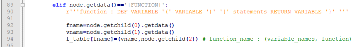
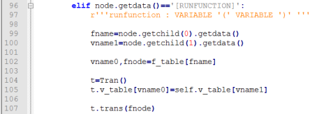
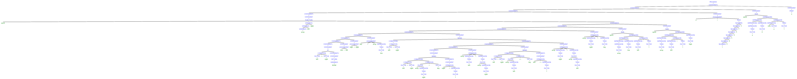
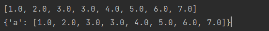
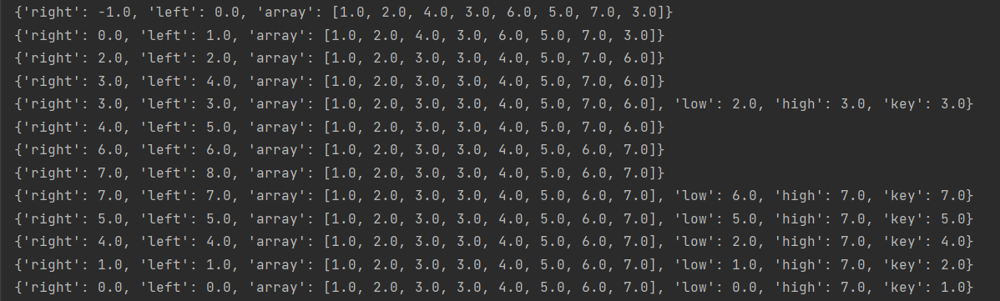

| 院系       | 年级专业 | 姓名   | 学号       | 实验日期  |
| ---------- | -------- | ------ | ---------- | --------- |
| 计算机学院 | 2019计科 | 吴家隆 | 1915404063 | 2021.12.6 |

*编程语言：**python3.9***

------

[TOC]

# 实验内容

- 利用PLY实现的Python程序的解析

  本次学习的语法是***函数语句***，需要注意的是本次使用的语法做了一些改进，不是纯粹的python2语法。

  需要结合上次课四则运算的解析程序

  1.示例程序位于example4/

  2.需要进行解析的文件为快速排序

  quick_sort.py

  ```python
  def quick_sort(array, left, right){
      if(left >= right){
          return
      }
      low = left
      high = right
      key = array[low]
      while(left < right){
          while(left < right and array[right] > key){
              right -= 1
          }
          array[left] = array[right]
          while(left < right and array[left] <= key){
              left += 1
          }
          array[right] = array[left]
      }
      array[right] = key
      quick_sort(array, low, left - 1)
      quick_sort(array, left + 1, high)
  }
  
  a=[1,2,4,3,6,5,7,3]
  
  quick_sort(a,0,len(a)-1)
  
  print(a)
  ```

  3.解析结果以语法树的形式呈现

- 编程实现语法制导翻译

  函数的解析分为2部分：

  1.函数的定义的解析：通过一个函数表来保存每个函数的信息

  
  
  2.函数的调用：当函数需要调用时，访问函数表，找到相应的函数名，并进行调用



# 实验步骤

## 使用lex进行序列标记

在本次实验中要识别的tokens包括以下

```python
tokens = ('VARIABLE', 'NUMBER', 'IF', 'WHILE', 'PRINT', 'DEF', 'RETURN', 'AND', 'LEN')

literals = ['=', '+', '-', '*', '(', ')', '{', '}', '<', '>', ',', '[', ']']
```

ply使用"t_"开头的变量来表示规则。如果变量是一个字符串，那么它被解释为一个正则表达式，匹配值是标记的值。 如果变量是函数，则其文档字符串包含模式，并使用匹配的标记调用该函数。该函数可以自由地修改序列或返回一个新的序列来代替它的位置。 如果没有返回任何内容，则忽略匹配。 通常该函数只更改“value”属性，它最初是匹配的文本。

```python
def t_NUMBER(t):
    r'[0-9]+'
    return t
def t_PRINT(t):
    r'print'
    return t
def t_IF(t):
    r'if'
    return t
def t_WHILE(t):
    r'while'
    return t
def t_DEF(t):
    r'def'
    return t
def t_RETURN(t):
    r'return'
    return t
def t_AND(t):
    r'and'
    return t
def t_LEN(t):
    r'len'
    return t
def t_VARIABLE(t):
    r'[a-zA-Z\$_][a-zA-Z\d_]*'
    return t
# Ignored
t_ignore = " \t"
def t_error(t):
    print("Illegal character '%s'" % t.value[0])
    t.lexer.skip(1)
```

对quick_sort.py进行测试，输出每一个识别到的token

```python
from util import clear_text
text=clear_text(open('quick_sort.py','r').read())
lex.input(text)
for tok in iter(lex.token, None):
    print(repr(tok.type), repr(tok.value))
```

util中的clear_text函数为清除每行的空格

```python
def clear_text(text):
    lines=[]
    for line in text.split('\n'):
        line=line.strip()
        if len(line)>0:
            lines.append(line)
    return ' '.join(lines)
```

## 使用yacc进行语法分析

PLY 的解析器适用于lex解析出的序列标记。 它使用 BNF 语法来描述这些标记是如何组装的。 

对node进行定义

```python
class node:
    def __init__(self, data):
        self._data = data
        self._children = []
        self._value = None
    def getdata(self):
        return self._data
    def setvalue(self, value):
        self._value = value
    def getvalue(self):
        return self._value
    def getchild(self, i):
        return self._children[i]
    def getchildren(self):
        return self._children
    def add(self, node):
        self._children.append(node)
    def print_node(self, prefix):
        print ('  ' * prefix, '+', self._data)
        for child in self._children:
            child.print_node(prefix + 1)
def num_node(data):
    t = node(data)
    t.setvalue(float(data))
    return t
```

定义文法

```python
# YACC for parsing Python
def simple_node(t, name):
    t[0] = node(name)
    for i in range(1, len(t)):
        t[0].add(node(t[i]))
    return t[0]
def p_program(t):
    '''program : statements'''
    if len(t) == 2:
        t[0] = node('[PROGRAM]')
        t[0].add(t[1])
def p_statements(t):
    '''statements : statements statement
                  | statement'''
    if len(t) == 3:
        t[0] = node('[STATEMENTS]')
        t[0].add(t[1])
        t[0].add(t[2])
    elif len(t) == 2:
        t[0] = node('[STATEMENTS]')
        t[0].add(t[1])
def p_statement(t):
    ''' statement :
                  | assignment
                  | operation
                  | print
                  | if
                  | while
                  | function
                  | run_function
                  | return'''
    if len(t) == 1:
        t[0] = node('[STATEMENT]')
        t[0].add(node('[NONE]'))
    elif len(t) == 2:
        t[0] = node('[STATEMENT]')
        t[0].add(t[1])
def p_assignment(t):
    '''assignment : VARIABLE '=' NUMBER
                  | VARIABLE '[' expression ']' '=' NUMBER
                  | VARIABLE '=' VARIABLE
                  | VARIABLE '=' VARIABLE '[' expression ']'
                  | VARIABLE '=' num_list'''
    if len(t) == 4:
        if isinstance(t[3], str):       # NUMBER or VARIABLE
            if ord('0') <= ord(t[3][0]) <= ord('9'):    # NUMBER
                t[0] = node('[ASSIGNMENT]')
                t[0].add(node(t[1]))
                t[0].add(node(t[2]))
                t[0].add(num_node(t[3]))
            else:                                       # VARIABLE
                t[0] = node('[ASSIGNMENT]')
                t[0].add(node(t[1]))
                t[0].add(node(t[2]))
                t[0].add(node(t[3]))
        else:                           # num_list
            t[0] = node('[ASSIGNMENT]')
            t[0].add(node(t[1]))
            t[0].add(node(t[2]))
            t[0].add(t[3])
    elif len(t) == 7:
        if t[2] == '[':                 # NUMBER
            t[0] = node('[ASSIGNMENT]')
            t[0].add(node(t[1]))
            t[0].add(t[3])
            t[0].add(node(t[5]))
            t[0].add(num_node(t[6]))
        else:                           # VARIABLE '[' expression ']'
            t[0] = node('[ASSIGNMENT]')
            t[0].add(node(t[1]))
            t[0].add(node(t[2]))
            t[0].add(node(t[3]))
            t[0].add(t[5])
def p_num_list(t):
    '''num_list : '[' numbers ']' '''
    if len(t) == 4:
        t[0] = node('[NUM_LIST]')
        t[0].add(t[2])
def p_numbers(t):
    '''numbers : NUMBER
               | numbers ',' NUMBER'''
    if len(t) == 2:
        t[0] = node('[NUMBERS]')
        t[0].add(num_node(t[1]))
    elif len(t) == 4:
        t[0] = node('[NUMBERS]')
        t[0].add(t[1])
        t[0].add(num_node(t[3]))
def p_operation(t):
    '''operation : VARIABLE '=' expression
                 | VARIABLE '+' '=' expression
                 | VARIABLE '-' '=' expression
                 | VARIABLE '[' expression ']' '=' expression'''
    if len(t) == 4:
        t[0] = node('[OPERATION]')
        t[0].add(node(t[1]))
        t[0].add(node(t[2]))
        t[0].add(t[3])
    elif len(t) == 5:
        t[0] = node('[OPERATION]')
        t[0].add(node(t[1]))
        t[0].add(node(t[2] + t[3]))
        t[0].add(t[4])
    elif len(t) == 7:
        t[0] = node('[OPERATION]')
        t[0].add(node(t[1]))
        t[0].add(t[3])
        t[0].add(node(t[5]))
        t[0].add(t[6])
def p_expression(t):
    '''expression : expression '+' term
                  | expression '-' term
                  | term
                  | LEN '(' factor ')' '''
    if len(t) == 4:
        t[0] = node('[EXPRESSION]')
        t[0].add(t[1])
        t[0].add(node(t[2]))
        t[0].add(t[3])
    elif len(t) == 2:
        t[0] = node('[EXPRESSION]')
        t[0].add(t[1])
    elif len(t) == 5:
        t[0] = node('[EXPRESSION]')
        t[0].add(node('[LEN]'))
        t[0].add(t[3])
def p_term(t):
    '''term : term '*' factor
            | term '/' factor
            | factor'''
    if len(t) == 4:
        t[0] = node('[TERM]')
        t[0].add(t[1])
        t[0].add(node(t[2]))
        t[0].add(t[3])
    elif len(t) == 2:
        t[0] = node('[TERM]')
        t[0].add(t[1])
def p_factor(t):
    '''factor : NUMBER
              | VARIABLE
              | VARIABLE '[' expression ']'
              | '(' expression ')' '''
    if len(t) == 2:
        if ord('0') <= ord(t[1][0]) <= ord('9'):       # NUMBER
            t[0] = node('[FACTOR]')
            t[0].add(num_node(t[1]))
        else:                                          # VARIABLE
            t[0] = node('[FACTOR]')
            t[0].add(node(t[1]))
    elif len(t) == 4:
        t[0] = node('[FACTOR]')
        t[0].add(t[2])
    elif len(t) == 5:
        t[0] = node('[FACTOR]')
        t[0].add(node(t[1]))
        t[0].add(t[3])
def p_print(t):
    '''print : PRINT '(' VARIABLE ')' '''
    if len(t) == 5:
        t[0] = node('[PRINT]')
        t[0].add(node(t[3]))
def p_if(t):
    '''if : IF '(' condition ')' '{' statements '}' '''
    if len(t) == 8:
        t[0] = node('[IF]')
        t[0].add(t[3])
        t[0].add(t[6])
def p_while(t):
    '''while : WHILE '(' conditions ')' '{' statements '}' '''
    if len(t) == 8:
        t[0] = node('[WHILE]')
        t[0].add(t[3])
        t[0].add(t[6])
def p_conditions(t):
    '''conditions : condition
                  | condition AND condition'''
    if len(t) == 2:
        t[0] = node('[CONDITIONS]')
        t[0].add(t[1])
    elif len(t) == 4:
        t[0] = node('[CONDITIONS]')
        t[0].add(t[1])
        t[0].add(t[3])
def p_condition(t):
    '''condition : factor '>' factor
                 | factor '<' factor
                 | factor '<' '=' factor
                 | factor '>' '=' factor'''
    if len(t) == 4:
        t[0] = node('[CONDITION]')
        t[0].add(t[1])
        t[0].add(node(t[2]))
        t[0].add(t[3])
    elif len(t) == 5:
        t[0] = node('[CONDITION]')
        t[0].add(t[1])
        t[0].add(node(t[2] + t[3]))
        t[0].add(t[4])
def p_function(t):
    '''function : DEF VARIABLE '(' variables ')' '{' statements '}' '''
    if len(t) == 9:
        t[0] = node('[FUNCTION]')
        t[0].add(node(t[2]))
        t[0].add(t[4])
        t[0].add(t[7])
def p_run_function(t):
    '''run_function : VARIABLE '(' expressions ')' '''
    if len(t) == 5:
        t[0] = node('[RUN_FUNCTION]')
        t[0].add(node(t[1]))
        t[0].add(t[3])
def p_variables(t):
    '''variables :
                 | VARIABLE
                 | variables ',' VARIABLE'''
    if len(t) == 1:
        t[0] = node('[VARIABLES]')
        t[0].add(node('[NONE]'))
    elif len(t) == 2:
        t[0] = node('[VARIABLES]')
        t[0].add(node(t[1]))
    elif len(t) == 4:
        t[0] = node('[VARIABLES]')
        t[0].add(t[1])
        t[0].add(node(t[3]))
def p_expressions(t):
    '''expressions : expression
                   | expressions ',' expression'''
    if len(t) == 2:
        t[0] = node('[EXPRESSIONS]')
        t[0].add(t[1])
    elif len(t) == 4:
        t[0] = node('[EXPRESSIONS]')
        t[0].add(t[1])
        t[0].add(t[3])
def p_return(t):
    '''return : RETURN variables'''
    if len(t) == 3:
        t[0] = node('[RETURN]')
        t[0].add(t[2])
def p_error(t):
    print("Syntax error at '%s'" % t.value)
yacc.yacc()
```

## 实现语法制导翻译

定义变量存储函数

```python
f_table={}
```

定义Tran类来进行翻译

v_table 存储变量

update_v_table函数对变量表进行更新

```python
class Tran:
    def __init__(self):
        self.v_table = {}  # variable table
    def update_v_table(self, name, value):
        self.v_table[name] = value
```

ASSIGNMENT的文法
$$
ASSIGENMENT:\\
VARIABLE = NUMBER\\
|VARIABLE[expression] = NUMBER\\
|VARIABLE=VARIABLE\\
|VARIABLE = VARIABLE[expression]
|VARIABLE= num\_list
$$

```python
def trans(self, node):
    # Translation
    # Assignment
    if node.getdata() == '[ASSIGNMENT]':
        r'''assignment : VARIABLE '=' NUMBER
                       | VARIABLE '[' expression ']' '=' NUMBER
                       | VARIABLE '=' VARIABLE
                       | VARIABLE '=' VARIABLE '[' expression ']'
                       | VARIABLE '=' num_list'''
        if len(node.getchildren()) == 3:
            if ord('0') <= ord(node.getchild(2).getdata()[0]) <= ord('9'):  # NUMBER
                value = node.getchild(2).getvalue()
                # update v_table
                self.update_v_table(node.getchild(0).getdata(), value)
            elif node.getchild(2).getdata() == '[NUM_LIST]':  # num_list
                self.trans(node.getchild(2))
                value = node.getchild(2).getvalue()
                # update v_table
                self.update_v_table(node.getchild(0).getdata(), value)
            else:  # VARIABLE
                value = self.v_table[node.getchild(2).getdata()]
                # update v_table
                self.update_v_table(node.getchild(0).getdata(), value)
        elif len(node.getchildren()) == 4:
            if node.getchild(2).getdata() == '=':  # NUMBER
                arg = self.v_table[node.getchild(0).getdata()]
                self.trans(node.getchild(1))
                index = int(node.getchild(1).getvalue())
                value = node.getchild(3).getvalue()
                # update VARIABLE
                arg[index] = value
            elif node.getchild(1).getdata() == '=':  # VARIABLE '[' expression ']'
                arg1 = self.v_table[node.getchild(2).getdata()]
                self.trans(node.getchild(3))
                index = int(node.getchild(3).getvalue())
                value = arg1[index]
                # update v_table
                self.update_v_table(node.getchild(0).getdata(), value)
```

Num_list
$$
num\_list:\\
[numebers]
$$


```python
elif node.getdata() == '[NUM_LIST]':
    '''num_list : '[' numbers ']' '''
    if len(node.getchildren()) == 1:
        self.trans(node.getchild(0))
        value = [float(x) for x in node.getchild(0).getvalue().split()]
        node.setvalue(value)
```

Numbers
$$
numbers:\\
NUMBER\\
|numbers,NUMBER
$$


```python
elif node.getdata() == '[NUMBERS]':
    '''numbers : NUMBER
               | numbers ',' NUMBER'''
    if len(node.getchildren()) == 1:
        value = str(node.getchild(0).getvalue())
        node.setvalue(value)
    elif len(node.getchildren()) == 2:
        self.trans(node.getchild(0))
        value0 = node.getchild(0).getvalue()
        value1 = str(node.getchild(1).getvalue())
        value = value0 + ' ' + value1
        node.setvalue(value)
```

Operation
$$
operation : \\
VARIABLE=expression\\
| VARIABLE += expression\\
| VARIABLE -= expression\\
| VARIABLE [ expression ] = expression
$$

```python
elif node.getdata() == '[OPERATION]':
    '''operation : VARIABLE '=' expression
                 | VARIABLE '+' '=' expression
                 | VARIABLE '-' '=' expression
                 | VARIABLE '[' expression ']' '=' expression'''
    if len(node.getchildren()) == 3:
        if node.getchild(1).getdata()[0] == '=':  # '='
            self.trans(node.getchild(2))
            value = node.getchild(2).getvalue()
            node.getchild(0).setvalue(value)
            # update v_table
            self.update_v_table(node.getchild(0).getdata(), value)
        elif node.getchild(1).getdata()[1] == '=':  # '+=' or '-='
            arg1 = self.v_table[node.getchild(0).getdata()]
            self.trans(node.getchild(2))
            arg2 = node.getchild(2).getvalue()
            op = node.getchild(1).getdata()[0]
            if op == '+':
                value = arg1 + arg2
            elif op == '-':
                value = arg1 - arg2
            node.getchild(0).setvalue(value)
            # update v_table
            self.update_v_table(node.getchild(0).getdata(), value)
    elif len(node.getchildren()) == 4:
        arg = self.v_table[node.getchild(0).getdata()]
        self.trans(node.getchild(1))
        index = int(node.getchild(1).getvalue())
        self.trans(node.getchild(3))
        value = node.getchild(3).getvalue()
        # update VARIABLE
        arg[index] = value
```

Expression
$$
expr:\\
expression + term\\
|expression-term\\
|term\\
|LEN(factor)
$$


```python
elif node.getdata() == '[EXPRESSION]':
    '''expr : expression '+' term
            | expression '-' term
            | term
            | LEN '(' factor ')' '''
    if len(node.getchildren()) == 3:
        self.trans(node.getchild(0))
        arg0 = node.getchild(0).getvalue()
        self.trans(node.getchild(2))
        arg1 = node.getchild(2).getvalue()
        op = node.getchild(1).getdata()
        if op == '+':
            value = arg0 + arg1
        elif op == '-':
            value = arg0 - arg1
        node.setvalue(value)
    elif len(node.getchildren()) == 1:  # term
        self.trans(node.getchild(0))
        value = node.getchild(0).getvalue()
        node.setvalue(value)
    elif len(node.getchildren()) == 2:
        self.trans(node.getchild(1))
        value = len(node.getchild(1).getvalue())
        node.setvalue(value)
```

Term
$$
term:\\
term*factor\\
|term/factor\\
|factor
$$

```python
elif node.getdata() == '[TERM]':
    '''term : term '*' factor
            | term '/' factor
            | factor'''
    if len(node.getchildren()) == 3:
        self.trans(node.getchild(0))
        arg0 = node.getchild(0).getvalue()
        self.trans(node.getchild(2))
        arg1 = node.getchild(2).getvalue()
        op = node.getchild(1).getdata()
        if op == '*':
            value = arg0 + arg1
        elif op == '/':
            value = arg0 - arg1
        node.setvalue(value)
    elif len(node.getchildren()) == 1:
        self.trans(node.getchild(0))
        value = node.getchild(0).getvalue()
        node.setvalue(value)
```

factor
$$
factor:\\
NUMBER\\
|VARIABLE\\
|VARIABLE[expression]\\
|(expression)
$$

```python
elif node.getdata() == '[FACTOR]':
    '''factor : NUMBER
              | VARIABLE
              | VARIABLE '[' expression ']'
              | '(' expression ')' '''
    if len(node.getchildren()) == 1:
        if ord('0') <= ord(node.getchild(0).getdata()[0]) <= ord('9'):  # NUMBER
            value = node.getchild(0).getvalue()
            node.setvalue(value)
        elif node.getchild(0).getdata() == '[EXPRESSION]':              # '(' expr ')'
            self.trans(node.getchild(0))
            value = node.getchild(0).getvalue()
            node.setvalue(value)
        else:                                                           # VARIABLE
            value = self.v_table[node.getchild(0).getdata()]
            node.setvalue(value)
    elif len(node.getchildren()) == 2:
        arg = self.v_table[node.getchild(0).getdata()]
        self.trans(node.getchild(1))
        index = int(node.getchild(1).getvalue())
        value = arg[index]
        node.setvalue(value)
```

print
$$
print:\\
PRINT(VARIABLE)
$$

```python
elif node.getdata() == '[PRINT]':
    '''print : PRINT '(' VARIABLE ')' '''
    arg0 = self.v_table[node.getchild(0).getdata()]
    print(arg0)
```

If
$$
if:\\
IF(condition)\{statements\}
$$

```python
elif node.getdata() == '[IF]':
    r'''if : IF '(' condition ')' '{' statements '}' '''
    children = node.getchildren()
    self.trans(children[0])
    condition = children[0].getvalue()
    if condition:
        for c in children[1:]:
            value = self.trans(c)
            if isinstance(value, list) and value[0] == '[RETURN]':
                return value
```

Whlie
$$
while:\\
WHILE(conditions)\{statements\}
$$

```python
elif node.getdata() == '[WHILE]':
    r'''while : WHILE '(' conditions ')' '{' statements '}' '''
    children = node.getchildren()
    while self.trans(children[0]):
        for c in children[1:]:
            self.trans(c)
```

Conditions
$$
conditions:\\
condition\\
|condition AND condition
$$

```python
elif node.getdata() == '[CONDITIONS]':
    '''conditions : condition
                  | condition AND condition'''
    if len(node.getchildren()) == 1:
        self.trans(node.getchild(0))
        value = node.getchild(0).getvalue()
        node.setvalue(value)
    elif len(node.getchildren()) == 2:
        self.trans(node.getchild(0))
        arg0 = node.getchild(0).getvalue()
        self.trans(node.getchild(1))
        arg1 = node.getchild(1).getvalue()
        value = arg0 and arg1
        node.setvalue(value)
```

Condition
$$
condition:\\
factor>factor\\
|factor<factor\\
|factor<=factor\\
|factor>=factor
$$

```python
elif node.getdata() == '[CONDITION]':
    '''condition : factor '>' factor
                 | factor '<' factor
                 | factor '<' '=' factor
                 | factor '>' '=' factor'''
    self.trans(node.getchild(0))
    arg0 = node.getchild(0).getvalue()
    self.trans(node.getchild(2))
    arg1 = node.getchild(2).getvalue()
    op = node.getchild(1).getdata()
    if op == '>':
        node.setvalue(arg0 > arg1)
    elif op == '<':
        node.setvalue(arg0 < arg1)
    elif op == '<=':
        node.setvalue(arg0 <= arg1)
    elif op == '>=':
        node.setvalue(arg0 >= arg1)
```

Function
$$
function:
DEF VARIABLE(variables)\{statements\}
$$

```python
elif node.getdata() == '[FUNCTION]':
    '''function : DEF VARIABLE '(' variables ')' '{' statements '}' '''
    fname = node.getchild(0).getdata()
    self.trans(node.getchild(1))
    vname = node.getchild(1).getvalue()
    f_table[fname] = (vname, node.getchild(2))  # function_name : (variable_names, function)
```

Run_function
$$
run\_function:VARIABLE(expressions)
$$

```python
elif node.getdata() == '[RUN_FUNCTION]':
    '''run_function : VARIABLE '(' expressions ')' '''
    fname = node.getchild(0).getdata()
    self.trans(node.getchild(1))
    vname1 = node.getchild(1).getvalue()
    vname0, fnode = f_table[fname]
    t = Tran()
    for i in range(len(vname1)):
        t.v_table[vname0[i]] = vname1[i]
    value = t.trans(fnode)
    if isinstance(value, list):
        node.setvalue(value[1])
    print(t.v_table)
```

Variables
$$
variables:\\
VARIABLE\\
|variables,VARIABLE
$$

```python
elif node.getdata() == '[VARIABLES]':
    '''variables :
                 | VARIABLE
                 | variables ',' VARIABLE'''
    if len(node.getchildren()) == 1:
        if node.getchild(0).getdata() == '[NONE]':  # NONE
            value = []
            node.setvalue(value)
        else:                                       # VARIABLE
            value = [node.getchild(0).getdata()]
            node.setvalue(value)
    elif len(node.getchildren()) == 2:
        self.trans(node.getchild(0))
        value0 = node.getchild(0).getvalue()
        value = [node.getchild(1).getdata()]
        value.extend(value0)
        node.setvalue(value)
```

Expressions
$$
expressions:\\
expression\\
|expression,expression
$$

```python
elif node.getdata() == '[EXPRESSIONS]':
    '''expressions : expression
                   | expressions ',' expression'''
    if len(node.getchildren()) == 1:
        self.trans(node.getchild(0))
        value = [node.getchild(0).getvalue()]
        node.setvalue(value)
    elif len(node.getchildren()) == 2:
        self.trans(node.getchild(0))
        value0 = node.getchild(0).getvalue()
        self.trans(node.getchild(1))
        value = [node.getchild(1).getvalue()]
        value.extend(value0)
        node.setvalue(value)
```

Return
$$
return:RETURN variables
$$

```python
elif node.getdata() == '[RETURN]':
    '''return : RETURN variables'''
    return ['[RETURN]', node.getchild(0).getvalue()]
else:
    for c in node.getchildren():
        value = self.trans(c)
        if isinstance(value, list) and value[0] == '[RETURN]':
            return value
return node.getvalue()
```

# 实验结果

## 主程序代码

```python
def translation(filename):
    text = clear_text(open(filename, 'r').read())
    def put2str(node):
        global res
        if node:
            data = str(node._data)
            data = data.replace("[", "").replace("]", "").replace("/'", "")
            res += data
        if node._children:
            for i in node._children:
                res += "["
                put2str(i)
                res += "]"
    # syntax parse
    root = yacc.parse(text)
    root.print_node(0)
    # translation
    t = Tran()
    t.trans(root)
    print(t.v_table)

    put2str(root)
    print("["+res+"]")
if __name__ == '__main__':
    res = ""
    translation("quick_sort.py")
```

## 结果

字符串形式的语法树



输出

```python
+ [PROGRAM]
  + [STATEMENTS]
    + [STATEMENTS]
      + [STATEMENTS]
        + [STATEMENTS]
          + [STATEMENT]
            + [FUNCTION]
              + quick_sort
              + [VARIABLES]
                + [VARIABLES]
                  + [VARIABLES]
                    + array
                  + left
                + right
              + [STATEMENTS]
                + [STATEMENTS]
                  + [STATEMENTS]
                    + [STATEMENTS]
                      + [STATEMENTS]
                        + [STATEMENTS]
                          + [STATEMENTS]
                            + [STATEMENTS]
                              + [STATEMENT]
                                + [IF]
                                  + [CONDITION]
                                    + [FACTOR]
                                      + left
                                    + >=
                                    + [FACTOR]
                                      + right
                                  + [STATEMENTS]
                                    + [STATEMENT]
                                      + [RETURN]
                                        + [VARIABLES]
                                          + [NONE]
                            + [STATEMENT]
                              + [ASSIGNMENT]
                                + low
                                + =
                                + left
                          + [STATEMENT]
                            + [ASSIGNMENT]
                              + high
                              + =
                              + right
                        + [STATEMENT]
                          + [ASSIGNMENT]
                            + key
                            + =
                            + array
                            + [EXPRESSION]
                              + [TERM]
                                + [FACTOR]
                                  + low
                      + [STATEMENT]
                        + [WHILE]
                          + [CONDITIONS]
                            + [CONDITION]
                              + [FACTOR]
                                + left
                              + <
                              + [FACTOR]
                                + right
                          + [STATEMENTS]
                            + [STATEMENTS]
                              + [STATEMENTS]
                                + [STATEMENTS]
                                  + [STATEMENT]
                                    + [WHILE]
                                      + [CONDITIONS]
                                        + [CONDITION]
                                          + [FACTOR]
                                            + left
                                          + <
                                          + [FACTOR]
                                            + right
                                        + [CONDITION]
                                          + [FACTOR]
                                            + array
                                            + [EXPRESSION]
                                              + [TERM]
                                                + [FACTOR]
                                                  + right
                                          + >
                                          + [FACTOR]
                                            + key
                                      + [STATEMENTS]
                                        + [STATEMENT]
                                          + [OPERATION]
                                            + right
                                            + -=
                                            + [EXPRESSION]
                                              + [TERM]
                                                + [FACTOR]
                                                  + 1
                                + [STATEMENT]
                                  + [OPERATION]
                                    + array
                                    + [EXPRESSION]
                                      + [TERM]
                                        + [FACTOR]
                                          + left
                                    + =
                                    + [EXPRESSION]
                                      + [TERM]
                                        + [FACTOR]
                                          + array
                                          + [EXPRESSION]
                                            + [TERM]
                                              + [FACTOR]
                                                + right
                              + [STATEMENT]
                                + [WHILE]
                                  + [CONDITIONS]
                                    + [CONDITION]
                                      + [FACTOR]
                                        + left
                                      + <
                                      + [FACTOR]
                                        + right
                                    + [CONDITION]
                                      + [FACTOR]
                                        + array
                                        + [EXPRESSION]
                                          + [TERM]
                                            + [FACTOR]
                                              + left
                                      + <=
                                      + [FACTOR]
                                        + key
                                  + [STATEMENTS]
                                    + [STATEMENT]
                                      + [OPERATION]
                                        + left
                                        + +=
                                        + [EXPRESSION]
                                          + [TERM]
                                            + [FACTOR]
                                              + 1
                            + [STATEMENT]
                              + [OPERATION]
                                + array
                                + [EXPRESSION]
                                  + [TERM]
                                    + [FACTOR]
                                      + right
                                + =
                                + [EXPRESSION]
                                  + [TERM]
                                    + [FACTOR]
                                      + array
                                      + [EXPRESSION]
                                        + [TERM]
                                          + [FACTOR]
                                            + left
                    + [STATEMENT]
                      + [OPERATION]
                        + array
                        + [EXPRESSION]
                          + [TERM]
                            + [FACTOR]
                              + right
                        + =
                        + [EXPRESSION]
                          + [TERM]
                            + [FACTOR]
                              + key
                  + [STATEMENT]
                    + [RUN_FUNCTION]
                      + quick_sort
                      + [EXPRESSIONS]
                        + [EXPRESSIONS]
                          + [EXPRESSIONS]
                            + [EXPRESSION]
                              + [TERM]
                                + [FACTOR]
                                  + array
                          + [EXPRESSION]
                            + [TERM]
                              + [FACTOR]
                                + low
                        + [EXPRESSION]
                          + [EXPRESSION]
                            + [TERM]
                              + [FACTOR]
                                + left
                          + -
                          + [TERM]
                            + [FACTOR]
                              + 1
                + [STATEMENT]
                  + [RUN_FUNCTION]
                    + quick_sort
                    + [EXPRESSIONS]
                      + [EXPRESSIONS]
                        + [EXPRESSIONS]
                          + [EXPRESSION]
                            + [TERM]
                              + [FACTOR]
                                + array
                        + [EXPRESSION]
                          + [EXPRESSION]
                            + [TERM]
                              + [FACTOR]
                                + left
                          + +
                          + [TERM]
                            + [FACTOR]
                              + 1
                      + [EXPRESSION]
                        + [TERM]
                          + [FACTOR]
                            + high
        + [STATEMENT]
          + [ASSIGNMENT]
            + a
            + =
            + [NUM_LIST]
              + [NUMBERS]
                + [NUMBERS]
                  + [NUMBERS]
                    + [NUMBERS]
                      + [NUMBERS]
                        + [NUMBERS]
                          + [NUMBERS]
                            + [NUMBERS]
                              + 1
                            + 2
                          + 4
                        + 3
                      + 6
                    + 5
                  + 7
                + 3
      + [STATEMENT]
        + [RUN_FUNCTION]
          + quick_sort
          + [EXPRESSIONS]
            + [EXPRESSIONS]
              + [EXPRESSIONS]
                + [EXPRESSION]
                  + [TERM]
                    + [FACTOR]
                      + a
              + [EXPRESSION]
                + [TERM]
                  + [FACTOR]
                    + 0
            + [EXPRESSION]
              + [EXPRESSION]
                + [LEN]
                + [FACTOR]
                  + a
              + -
              + [TERM]
                + [FACTOR]
                  + 1
    + [STATEMENT]
      + [PRINT]
        + a
```

翻译结果



每次调用函数，函数局部变量的结果


